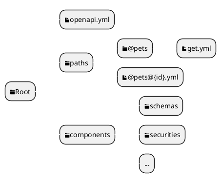

Openapiは便利ですよね。

Openapiファイルがあれば、Client生成できますし、Mockサーバも作成でき、サーバ同士の通信でも使えますし、どんなデータを許容するのかもわかります。(きちんと書いていればですが..)

ただ個人的には一つだけ難点があります。
それは、Openapiファイルは分割管理が難しいという点です。

分割管理が行えないと複数チームでの運用時に、コンフリクトが発生する頻度が高く、運用を工夫する必要がでてきます。

ただ、ありがたいことに、上記の課題は他の方々も課題を感じているようで、世の中に色々解決する手段があります。

そして公式の構文でも`$ref`という構文である程度の分割を出来るようになっています。

ただ公式の`$ref`も根本解決されません。

## 公式の`$ref`問題
`$ref`は以下のDocumentにある通り、非常に様々な書き方があります。
ただこちらも使える場所が決まっています。

基本コンフリクトが発生する部分は、`paths`と`components/schemas`以下がコンフリクトが発生します。

例えば以下の追加をbranchを分けてしようとするとコンフリクトが発生してしまいます。
```yaml
paths:
  ...
  /A: # Aチームが新しいエンドポイントの追加
    $ref: "./paths/A.yml#"
  /B: # Bチームが新しいエンドポイントの追加
    $ref: "./paths/B.yml#"
```

しかし、上記の時点でコンフリクトの解消難易度は低く、問題視しない選択肢も出てきます。
ただ、私はコンフリクトが発生する事自体を問題視しているので、上記の選択肢は排除しています。

そして、上記のようなコンフリクトを解消するようなライブラリが、私が探した限りだと見つからず。
問題解決する為に、yamlをコンフリクトせず管理するようなライブラリを作成しました。

## openapi-yaml
### 設計
yamlをコンフリクトせずに、分割させるにはエンドポイントの追加や削除で`paths`直下のプロパティが変化しない事と、
モデルの追加、削除で`components/schemas`配下が変化しない設計が必要になります。

今回の設計では、それをディレクトリ構造で解決しています。

以下のようなディレクトリ構造で`openapi-yaml`を利用した場合


>ファイル名の@は/の特殊文字<br/>
>ファイル名に/が使えない為出来た仕様です

`Root/openapi.yml`には以下の内容だけを記載すればよく、おそらくこのファイルを変更することは二度となく、他のファイルに関してもほぼコンフリクトはないでしょう。
```yaml:title=openapi.yml
...
paths:
    $dir: "./paths"
components:
    $dir: "./components"
```

### SourceCode
`openapi-yaml`は以下のRepositoryにあげてあります。

https://github.com/tanmen/openapi-yaml

MITライセンスの為、自由に改変し利用して頂いて問題ありません。

コントリビュートや、イシュー等も受け付けてますので、利用出来ない等の問題があった際はイシューにてよろしくお願いします。

## まとめ
Openapiを利用してて、苦労する部分はまだまだあると思います。
仕様自体が曖昧な部分もたくさんありますし、誰も困ってないからこそ手をつけられてない微妙な仕様があったりします。

ただこれだけ使われていて、大きな力を持っている仕様を絶やさない為にもコントリビュートや、便利にするライブラリを作りOpenapi界隈を盛り上げていくつもりです。

## 本来的な話
今回はドキュメント駆動開発での話が主でした。
ただ、Openapiはサーバから配布される形が主な為、サーバ駆動開発で行った場合は今回の問題点は全て関係ありません。

サーバ駆動開発で行った際に何故問題が解消されるのかというと、サーバ駆動開発ではOpenapiのドキュメントを管理することがなく、自動生成で生成されたOpenapiファイルを、実行されているAPIから受け取る形式になっているからです。

実態のドキュメントが無いため、ドキュメントを管理する上で起きるコンフリクトが起きないといった形です。
ドキュメント駆動開発以外の選択肢が取れ、Openapiのコンフリクトに悩まされている場合はサーバ駆動開発にシフトするのもありだと思います。
